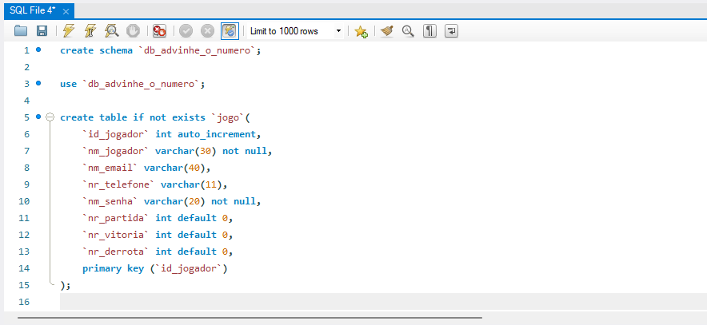
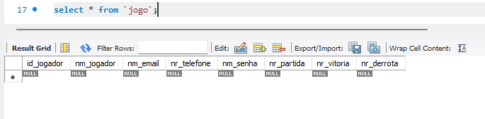
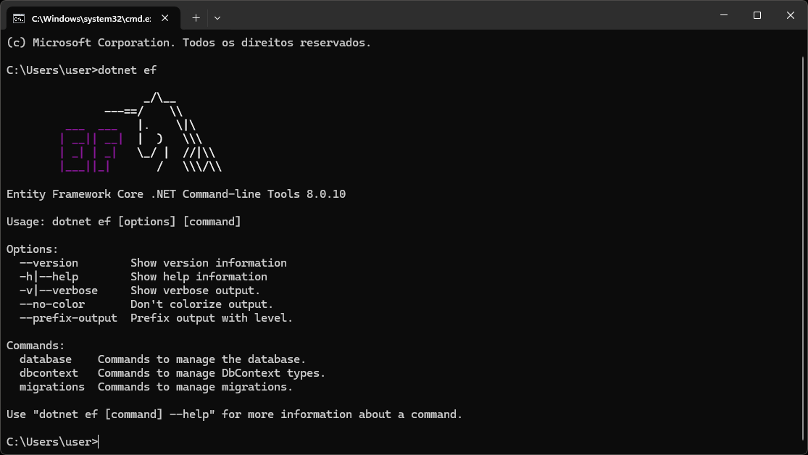
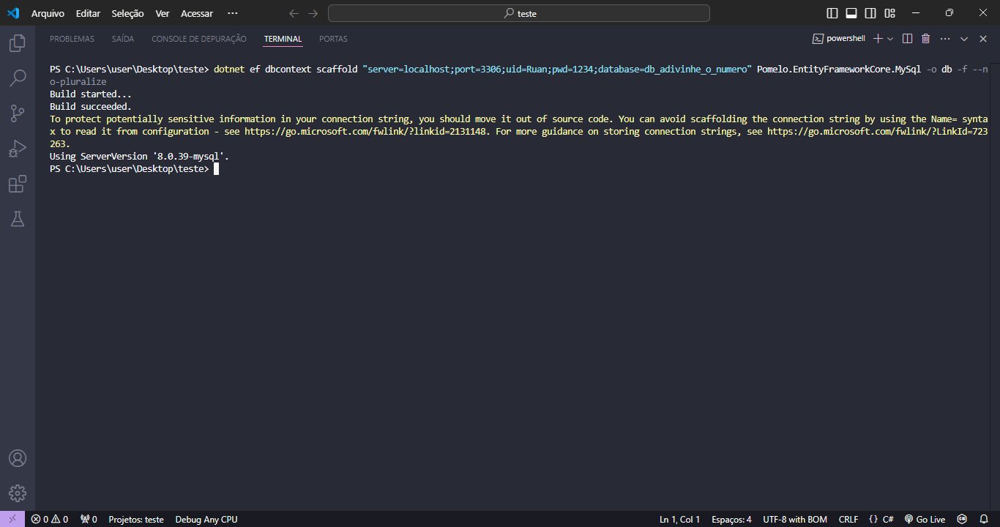

# AdivinheONumero

## Necessidades
- Banco de dados criado com a tabela no MySQL 
- Ferramenta EntityFrameworkCore 
- Extensões EntityFrameworkCore 
- Provider Pomelo
- Scaffolding

## Comandos 
O primeiro passo para preparar o local é criar o banco de dados na sua máquina, que servirá como servidor.

### Banco de dados MySQL
O primeiro passo, é criar o banco de dados e logo após a tabela.
```
create schema `db_advinhe_o_numero`;

use `db_advinhe_o_numero`;

create table if not exists `jogo`(
	`id_jogador` int auto_increment,
    `nm_jogador` varchar(30) not null,
    `nm_email` varchar(40),
    `nr_telefone` varchar(11),
    `nm_senha` varchar(20) not null,
    `nr_partida` int default 0,
    `nr_vitoria` int default 0,
    `nr_derrota` int default 0,
    primary key (`id_jogador`)
);
```



---
### Ferramenta EntityFrameworkCore
No terminal, instale a ferramenta EntityFrameworkCore, realizando o seguinte comando,

```
dotnet tool install --global dotnet-ef
```
Após, realizando o comando dotnet ef, se instalado corretamente, deve aparecer uma tela dessa forma:


---
### Extensões EntityFrameworkCore

Em sequência, é preciso instalar duas extensões do EntityFrameworkCore. No terminal dentro da pasta do programa, realize os comandos, um de cada vez.

```
dotnet add package Microsoft.EntityFrameworkCore
```
```
dotnet add package Microsoft.EntityFrameworkCore.Design
```
---
### Provider Pomelo
Dando continuidade, é necessário instalar o provider que será utilizado. Neste caso, usaremos o Pomelo, um provider criado pela comidade e que facilita muito nosso trabalho. No terminal dentro da pasta do programa, execute o comando:

```
dotnet add package Pomelo.EntityFrameworkCore.MySql
```
---
### Scaffolding
O último comando necessita de um de requisito muito importante, a string de conexão. Copie o código abaixo e substitua os campos, para isso, acesse o MySQL Workbench para consultar as informações. Deixe essa string guardada no momento.

```
"server=localhost;port=___;uid=___;pwd=__;database=___" 
```

Depois disso, basta realizar o próximo comando substituindo os campos -> string e pasta

```
dotnet ef dbcontext scaffold _string_ Pomelo.EntityFrameworkCore.MySql -o _pasta_ -f --no-pluralize
```


---
E pronto. Se todos os passos forem executados corretamente, seu programa já está conectado com o banco de dados!